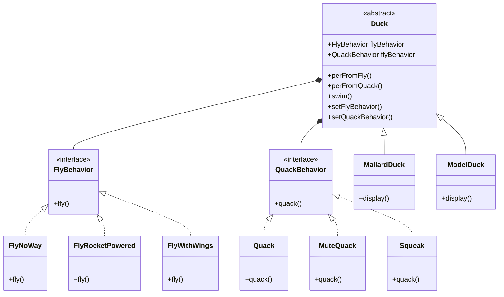
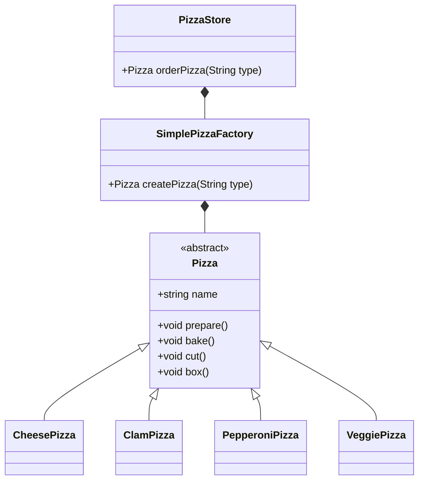
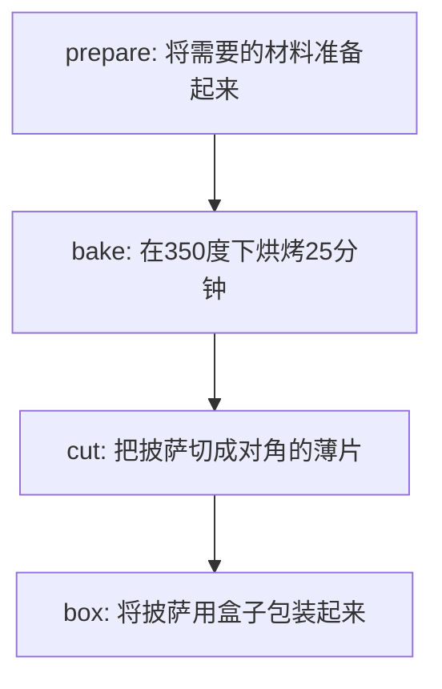



classDiagram
	class ClassA{
	+String name
	-int age
	#double weght
	~double height
	+String someField$
	}



> 

```mermaid
classDiagram
   FlyBehavior <|.. FlyNoWay
   FlyBehavior <|.. FlyRocketPowered
   FlyBehavior <|.. FlyWithWings
   QuackBehavior <|.. Quack
   QuackBehavior <|.. MuteQuack
   QuackBehavior <|.. Squeak
   Duck *-- FlyBehavior
   Duck *-- QuackBehavior
   Duck <|-- MallardDuck
   Duck <|-- ModelDuck
   class Duck{
      <<abstract>>
      +FlyBehavior flyBehavior
      +QuackBehavior flyBehavior
      +perFromFly()
      +perFromQuack()
      +swim()
      +setFlyBehavior()
      +setQuackBehavior()
   }
   class FlyBehavior{
      <<interface>>
       +fly()
   }
   class QuackBehavior{
      <<interface>>
      +quack()
   }
   class FlyNoWay{
       +fly()
   }
   class FlyRocketPowered{
       +fly()
   }
   class FlyWithWings{
       +fly()
   }
   class Quack{
      +quack()
   }
   class MuteQuack{
      +quack()
   }
   class Squeak{
      +quack()
   }
   class MallardDuck{
      +display()
   }
   class ModelDuck{
      +display()
   }
```

```mermaid
classDiagram
PizzaStore *-- SimplePizzaFactory
	SimplePizzaFactory *-- Pizza
	Pizza <|-- CheesePizza
	Pizza <|-- ClamPizza
	Pizza <|-- PepperoniPizza
	Pizza <|-- VeggiePizza
	
	class Pizza{
		<<abstract>>
		+string name
		+void prepare()
		+void bake()
		+void cut()
		+void box()
	}
	class CheesePizza{

	}
	class ClamPizza{

	}
	class PepperoniPizza{

	}
	class VeggiePizza{

	}
	
	class SimplePizzaFactory{
		+Pizza createPizza(String type)
	}
	class PizzaStore{
		+Pizza orderPizza(String type)
	}
	
```

```mermaid
  graph TD
    prepare[prepare: 将需要的材料准备起来]
    bake[bake: 在350度下烘烤25分钟]
    cut[cut: 把披萨切成对角的薄片]
    box[box: 将披萨用盒子包装起来]
    prepare --> bake
    bake --> cut 
    cut --> box 
```

