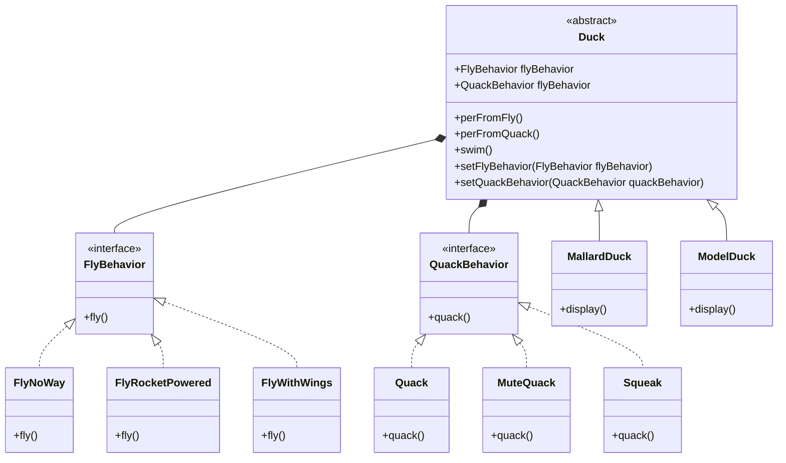

`定义算法族 分别封装起来 让他们之间可以互相替换 此模式让算法变化独立于使用算法的客人`

#### 使用到的设计原则：

- 多用组合，少用继承

### 《Head First 设计模式》案例

#### 鸭子类

行为(算法)： 飞行(fly)和叫(quack) 

不同的鸭子有不同的飞行方式和 叫的方式 不同的行为(算法)分别抽象成为不同的行为(算法)接口 一个行为接口可以实现多个行为 (算法)

在使用时 传递不同的行为(算法)实现 组合 成不同的鸭子

# Duck 类图

